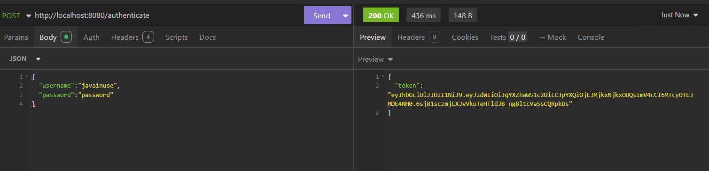
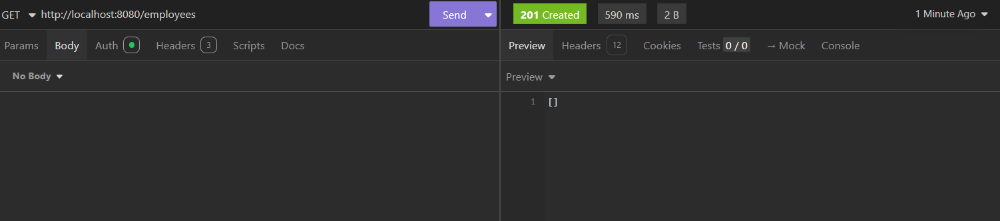

# Spring Boot 3 + JWT

## JSON Web Token (JWT)

Semelhante ao gerenciamento de sessão usando um ID de sessão, no caso do JWT, o usuário também precisará enviar o nome de usuário e a senha uma vez para o servidor. Uma vez autenticado, o servidor retorna um JWT que pode ser usado para todas as requisições subsequentes.

Vamos considerar novamente o cenário do Gmail. Aqui, o usuário enviará o nome de usuário e a senha apenas uma vez ao acessar a página da caixa de entrada. Uma vez autenticado, o Gmail retornará um JWT junto com a resposta. O usuário poderá, então, usar esse ID de sessão para acessar outras páginas, como a página de e-mails enviados. Além disso, se o usuário precisar acessar outros serviços do Google, como o Google Drive ou o YouTube, ele poderá fazê-lo usando esse JWT.

## Implementação
Faremos modificações no código que implementamos anteriormente para o exemplo de Spring Boot 3 + MySQL + CRUD. Primeiramente, iremos modificar o `pom.xml` para adicionar as dependências do Spring Security e do JWT.

```xml
<?xml version="1.0" encoding="UTF-8"?>
<project xmlns="http://maven.apache.org/POM/4.0.0" xmlns:xsi="http://www.w3.org/2001/XMLSchema-instance"
	xsi:schemaLocation="http://maven.apache.org/POM/4.0.0 https://maven.apache.org/xsd/maven-4.0.0.xsd">
	<modelVersion>4.0.0</modelVersion>
	<parent>
		<groupId>org.springframework.boot</groupId>
		<artifactId>spring-boot-starter-parent</artifactId>
		<version>3.2.10</version>
		<relativePath/> <!-- lookup parent from repository -->
	</parent>
	<groupId>com.example</groupId>
	<artifactId>boot-crud</artifactId>
	<version>0.0.1-SNAPSHOT</version>
	<name>boot-crud</name>
	<description>Demo project for Spring Boot</description>
	<url/>
	<licenses>
		<license/>
	</licenses>
	<developers>
		<developer/>
	</developers>
	<scm>
		<connection/>
		<developerConnection/>
		<tag/>
		<url/>
	</scm>
	<properties>
		<java.version>17</java.version>
	</properties>
	<dependencies>
		<dependency>
			<groupId>org.springframework.boot</groupId>
			<artifactId>spring-boot-starter-data-jpa</artifactId>
		</dependency>
		<dependency>
			<groupId>org.springframework.boot</groupId>
			<artifactId>spring-boot-starter-web</artifactId>
		</dependency>

		<dependency>
			<groupId>com.mysql</groupId>
			<artifactId>mysql-connector-j</artifactId>
			<scope>runtime</scope>
		</dependency>
		<dependency>
			<groupId>org.springframework.boot</groupId>
			<artifactId>spring-boot-starter-test</artifactId>
			<scope>test</scope>
		</dependency>

		<dependency>
			<groupId>org.springframework.boot</groupId>
			<artifactId>spring-boot-starter-security</artifactId>
		</dependency>
		<dependency>
			<groupId>io.jsonwebtoken</groupId>
			<artifactId>jjwt-api</artifactId>
			<version>0.11.5</version>
		</dependency>
		<dependency>
			<groupId>io.jsonwebtoken</groupId>
			<artifactId>jjwt-impl</artifactId>
			<version>0.11.5</version>
		</dependency>
		<dependency>
			<groupId>io.jsonwebtoken</groupId>
			<artifactId>jjwt-jackson</artifactId>
			<version>0.11.5</version>
		</dependency>
	</dependencies>

	<build>
		<plugins>
			<plugin>
				<groupId>org.springframework.boot</groupId>
				<artifactId>spring-boot-maven-plugin</artifactId>
			</plugin>
		</plugins>
	</build>

</project>
```
Para a implementação do JWT, dividiremos o fluxo de trabalho em duas partes:

1. Usando a URL `/authenticate`, geraremos o JWT.
2. Sempre que o usuário passar o JWT junto com a solicitação, o servidor o validará.

## Gerar JWT

Usando a URL `/authenticate`, o usuário gerará um JWT. Para isso, vamos adicionar a URL `/authenticate` à lista de URLs permitidas (whitelist) no Spring Security. Além disso, junto com esta solicitação, estaremos passando o nome de usuário e a senha.

Teremos o seguinte fluxo de trabalho:

1. O usuário acessa a URL `/authenticate` junto com as credenciais.
2. Vamos definir a configuração de segurança do Spring de forma que a URL `/authenticate` seja permitida (whitelisted).
3. Na cadeia de filtros (filter chain), vários filtros serão adicionados e chamados.
4. Um desses filtros será um filtro personalizado que estaremos criando, chamado `JWTRequestFilter`. Este filtro será responsável por interceptar a solicitação de entrada e verificar se ela possui um JWT válido. 
   - Se o JWT for válido, ele será validado; se não, essa classe não fará nada. Portanto, neste caso, este filtro não realizará nenhuma ação.
5. O `Authorization Filter` é o último filtro chamado na cadeia de filtros. Ele verifica se os filtros anteriores já autenticaram a solicitação e preencheram o contexto de segurança. Se não, esse filtro lançará uma exceção. No caso da URL `/authenticate`, como whitelistamos essa URL, a solicitação poderá passar pela cadeia de filtros sem autenticação.
6. Estaremos escrevendo um controlador personalizado chamado `JWTController`, que terá um mapeamento de URL POST para `/authenticate`. Neste método do controlador, obtemos as credenciais da solicitação do usuário e as autenticamos usando o serviço `UserDetailsImpl` que estaremos criando. Se a autenticação for bem-sucedida, chamaremos a classe `JWTTokenUtil`.
7. Na classe `JWTTokenUtil`, geramos um token, que é retornado ao usuário pelo `JWTController`.
8. Em seguida, criaremos uma classe de filtro personalizada chamada `JwtRequestFilter`. O `JwtRequestFilter` é um filtro que intercepta as solicitações HTTP de entrada e executa algumas ações antes que a solicitação seja passada para o próximo filtro ou recurso.
9. A classe `JwtRequestFilter` estende a classe `OncePerRequestFilter`, que é uma classe base para filtros que devem ser executados apenas uma vez por solicitação. Isso garante que a lógica do filtro seja aplicada apenas uma vez, mesmo que a solicitação passe por várias cadeias de filtros.
10. Dentro do método `doFilterInternal`, o filtro realiza as seguintes ações:
    1. Recupera o valor do cabeçalho "Authorization" da solicitação de entrada usando `request.getHeader("Authorization")`.
    2. Verifica se o token obtido começa com a string "Bearer ".
    3. Se o token começar com "Bearer ", pode-se presumir que é um JWT (JSON Web Token). O filtro pode então realizar processamento adicional no token, como validação ou extração de informações do usuário.
    4. Se o token não começar com "Bearer ", uma mensagem de aviso é registrada.
    5. Por fim, os objetos de solicitação e resposta são passados para o próximo filtro ou recurso na cadeia de filtros usando `filterChain.doFilter(request, response)`.

```java
package com.example.boot_crud.config;

import java.io.IOException;

import org.springframework.stereotype.Component;
import org.springframework.web.filter.OncePerRequestFilter;

@Component
public class JwtRequestFilter extends OncePerRequestFilter {

    @Override
    protected void doFilterInternal(jakarta.servlet.http.HttpServletRequest request,
                                    jakarta.servlet.http.HttpServletResponse response, jakarta.servlet.FilterChain filterChain)
            throws jakarta.servlet.ServletException, IOException {

        final String requestTokenHeader = request.getHeader("Authorization");

        // JWT Token is in the form "Bearer token". Remove Bearer word and get only the
        // Token
        if (requestTokenHeader != null && requestTokenHeader.startsWith("Bearer ")) {

        } else {
            logger.warn("JWT Token does not begin with Bearer String");
        }
        filterChain.doFilter(request, response);
    }
}
```
A classe `JwtUserDetailsService` é uma classe de serviço que implementa a interface `UserDetailsService`. Ela fornece um método chamado `loadUserByUsername`, que recebe um nome de usuário como entrada e retorna um objeto `UserDetails`. Nesta implementação específica, se o nome de usuário for "javainuse", ela cria um novo objeto `User` com esse nome de usuário, uma senha hash e uma lista vazia de autoridades. Se o nome de usuário não for "javainuse", ela lança uma `UsernameNotFoundException`. Esta classe é tipicamente utilizada para fins de autenticação em uma aplicação web que usa Tokens JWT (JSON Web Tokens) para autenticação e autorização de usuários.

```java
package com.example.boot_crud.service;

import java.util.ArrayList;

import org.springframework.security.core.userdetails.User;
import org.springframework.security.core.userdetails.UserDetails;
import org.springframework.security.core.userdetails.UserDetailsService;
import org.springframework.security.core.userdetails.UsernameNotFoundException;
import org.springframework.stereotype.Service;

@Service
public class JwtUserDetailsService implements UserDetailsService {

    @Override
    public UserDetails loadUserByUsername(String username) throws UsernameNotFoundException {
        if ("javainuse".equals(username)) {
            return new User("javainuse", "$2a$10$slYQmyNdGzTn7ZLBXBChFOC9f6kFjAqPhccnP6DxlWXx2lPk1C3G6",
                    new ArrayList<>());
        } else {
            throw new UsernameNotFoundException("User not found with username: " + username);
        }
    }
}
```
Em seguida, no arquivo de configuração de propriedades, especifique o `jwt-secret`. A chave secreta é usada pelo emissor do JWT para assinar o payload do token, que contém informações sobre o usuário ou os dados sendo transmitidos. O destinatário do JWT pode então usar a mesma chave secreta para verificar a assinatura, garantindo que o token não foi adulterado e pode ser confiável.

```properties
spring.application.name=boot-crud

spring.datasource.url= jdbc:mysql://localhost/javainusedb?createDatabaseIfNotExist=true&useSSL=false&allowPublicKeyRetrieval=true
spring.datasource.username= root
spring.datasource.password= root

spring.jpa.properties.hibernate.dialect= org.hibernate.dialect.MySQLDialect
spring.jpa.hibernate.ddl-auto= update

jwt.secret=404E635266556A586E3272357538782F413F4428472B4B6250645367566B5970
```
A classe `JwtTokenUtil` é uma classe utilitária usada para gerar JSON Web Tokens (JWTs) para autenticação e autorização de usuários. Ela é anotada com `@Component` para ser gerenciada pelo framework Spring. A classe contém uma chave secreta, que é usada para assinar os JWTs gerados por motivos de segurança. 

A classe fornece um método `generateToken(UserDetails userDetails)`, que gera um token JWT com os detalhes do usuário fornecidos. Também oferece outro método `generateToken(Map<String, Object> extraClaims, UserDetails userDetails)`, que permite adicionar reivindicações adicionais ao JWT. Ambos os métodos chamam internamente um método privado `buildToken()`, que constrói o JWT usando as reivindicações especificadas, a expiração e a chave de assinatura. A chave de assinatura é derivada da chave secreta fornecida no arquivo de propriedades da aplicação.

```java
package com.example.boot_crud.config;

import java.io.Serializable;
import java.security.Key;
import java.util.Date;
import java.util.HashMap;
import java.util.Map;
import java.util.function.Function;

import org.springframework.beans.factory.annotation.Value;
import org.springframework.security.core.userdetails.UserDetails;
import org.springframework.stereotype.Component;

import io.jsonwebtoken.Claims;
import io.jsonwebtoken.Jwts;
import io.jsonwebtoken.SignatureAlgorithm;
import io.jsonwebtoken.io.Decoders;
import io.jsonwebtoken.security.Keys;

@Component
public class JwtTokenUtil implements Serializable {

    private static final long serialVersionUID = 464214880478737476L;

    @Value("${jwt.secret}")
    private String secret;

    public String generateToken(UserDetails userDetails) {
        return generateToken(new HashMap<>(), userDetails);
    }

    public String generateToken(Map<String, Object> extraClaims, UserDetails userDetails) {
        return buildToken(extraClaims, userDetails, 1000000);
    }

    private String buildToken(Map<String, Object> extraClaims, UserDetails userDetails, long expiration) {
        return Jwts.builder().setClaims(extraClaims).setSubject(userDetails.getUsername())
                .setIssuedAt(new Date(System.currentTimeMillis()))
                .setExpiration(new Date(System.currentTimeMillis() + expiration))
                .signWith(getSignInKey(), SignatureAlgorithm.HS256).compact();
    }

    private Key getSignInKey() {
        byte[] keyBytes = Decoders.BASE64.decode(secret);
        return Keys.hmacShaKeyFor(keyBytes);
    }

    public String getUsername(String token) {
        return getClaim(token, Claims::getSubject);
    }

    public <T> T getClaim(String token, Function<Claims, T> claimsResolver) {
        final Claims claims = getAllClaims(token);
        return claimsResolver.apply(claims);
    }

    private boolean isTokenExpired(String token) {
        return getExpiration(token).before(new Date());
    }

    private Date getExpiration(String token) {
        return getClaim(token, Claims::getExpiration);
    }

    private Claims getAllClaims(String token) {
        return Jwts.parserBuilder().setSigningKey(getSignInKey()).build().parseClaimsJws(token).getBody();
    }

    public Boolean validateToken(String token, UserDetails userDetails) {
        final String username = getUsernameFromToken(token);
        return (username.equals(userDetails.getUsername())  && !isTokenExpired(token));
    }

    public String getUsernameFromToken(String token) {
        return getClaimFromToken(token, Claims::getSubject);
    }

    public <T> T getClaimFromToken(String token, Function<Claims, T> claimsResolver) {
        final Claims claims = getAllClaims(token);
        return claimsResolver.apply(claims);
    }
}
```
Em seguida, crie a classe `JwtRequest`, que será usada para as requisições de usuário recebidas e terá os campos `username` e `password`.

```java
package com.example.boot_crud.model;

import java.io.Serializable;

public class JwtRequest implements Serializable {

    private static final long serialVersionUID = 5926468583005150707L;

    private String username;
    private String password;

    //need default constructor for JSON Parsing
    public JwtRequest(){
    }

    public JwtRequest(String username, String password) {
        this.setUsername(username);
        this.setPassword(password);
    }

    public String getUsername() {
        return this.username;
    }

    public void setUsername(String username) {
        this.username = username;
    }

    public String getPassword() {
        return this.password;
    }

    public void setPassword(String password) {
        this.password = password;
    }
}
```
Criamos outra classe de entidade chamada `JwtResponse`. Esta classe terá um único campo chamado `jwttoken` e será retornada como resposta ao usuário após uma autenticação bem-sucedida.

```java
package com.example.boot_crud.model;

import java.io.Serializable;

public class JwtResponse implements Serializable {

    private static final long serialVersionUID = -8091879091924046844L;
    private final String jwttoken;

    public JwtResponse(String jwttoken) {
        this.jwttoken = jwttoken;
    }

    public String getToken() {
        return this.jwttoken;
    }
}
```

A classe `JwtAuthenticationController` é um `RestController` do Spring responsável por lidar com a autenticação via JWT (JSON Web Token). Ela é encarregada de autenticar as credenciais de um usuário e gerar um token para que usuários autenticados possam acessar recursos protegidos. A classe inclui várias dependências injetadas, como um `AuthenticationManager`, `JwtTokenUtil` e `UserDetailsService`. Ela possui um mapeamento de requisição para o endpoint "/authenticate", onde recebe um `JwtRequest` contendo as credenciais de autenticação do usuário. Em seguida, chama o método `authenticate` para validar as credenciais, carregar os detalhes do usuário e gerar um token JWT usando o `JwtTokenUtil`. Por fim, retorna um `ResponseEntity` com o token gerado em um objeto `JwtResponse`.

```java
package com.example.boot_crud.controller;

import java.util.Objects;

import org.springframework.beans.factory.annotation.Autowired;
import org.springframework.http.ResponseEntity;
import org.springframework.security.authentication.AuthenticationManager;
import org.springframework.security.authentication.BadCredentialsException;
import org.springframework.security.authentication.DisabledException;
import org.springframework.security.authentication.UsernamePasswordAuthenticationToken;
import org.springframework.security.core.userdetails.UserDetails;
import org.springframework.security.core.userdetails.UserDetailsService;
import org.springframework.web.bind.annotation.CrossOrigin;
import org.springframework.web.bind.annotation.RequestBody;
import org.springframework.web.bind.annotation.RequestMapping;
import org.springframework.web.bind.annotation.RequestMethod;
import org.springframework.web.bind.annotation.RestController;

import com.example.boot_crud.config.JwtTokenUtil;
import com.example.boot_crud.model.JwtRequest;
import com.example.boot_crud.model.JwtResponse;

@RestController
public class JwtAuthenticationController {

    @Autowired
    private AuthenticationManager authenticationManager;

    @Autowired
    private JwtTokenUtil jwtTokenUtil;

    @Autowired
    private UserDetailsService userDetailsService;

    @RequestMapping(value = "/authenticate", method = RequestMethod.POST)
    public ResponseEntity<?> createAuthenticationToken(@RequestBody JwtRequest authenticationRequest) throws Exception {

        authenticate(authenticationRequest.getUsername(), authenticationRequest.getPassword());

        final UserDetails userDetails = userDetailsService.loadUserByUsername(authenticationRequest.getUsername());

        final String token = jwtTokenUtil.generateToken(userDetails);

        return ResponseEntity.ok(new JwtResponse(token));
    }

    private void authenticate(String username, String password) throws Exception {
        Objects.requireNonNull(username);
        Objects.requireNonNull(password);

        try {
            authenticationManager.authenticate(new UsernamePasswordAuthenticationToken(username, password));
        } catch (DisabledException e) {
            throw new Exception("USER_DISABLED", e);
        } catch (BadCredentialsException e) {
            throw new Exception("INVALID_CREDENTIALS", e);
        }
    }
}
```

A classe `WebSecurityConfig` é uma classe de configuração que gerencia a configuração de segurança de uma aplicação web. Ela utiliza o Spring Security para definir regras de autenticação e autorização. 

Nesta classe, um `JwtRequestFilter` é injetado, o qual é responsável por autenticar requisições JWT. O bean `authenticationManager` é utilizado para autenticar usuários com base na `AuthenticationConfiguration` fornecida. 

O bean `passwordEncoder` é usado para codificar senhas para armazenamento seguro. O bean `filterChain` configura as definições de segurança HTTP, desabilitando a proteção CSRF e definindo a política de criação de sessão como stateless. O método `authorizeHttpRequests` é utilizado para definir regras de autorização, permitindo todas as requisições ao endpoint "/authenticate" e exigindo autenticação para todas as outras requisições. Por fim, o filtro de requisição JWT é adicionado antes do `UsernamePasswordAuthenticationFilter`.

```java
package com.example.boot_crud.config;

import com.example.boot_crud.config.JwtRequestFilter;
import org.springframework.beans.factory.annotation.Autowired;
import org.springframework.context.annotation.Bean;
import org.springframework.context.annotation.Configuration;
import org.springframework.security.authentication.AuthenticationManager;
import org.springframework.security.config.annotation.authentication.configuration.AuthenticationConfiguration;
import org.springframework.security.config.annotation.web.builders.HttpSecurity;
import org.springframework.security.config.http.SessionCreationPolicy;
import org.springframework.security.core.userdetails.UserDetailsService;
import org.springframework.security.crypto.bcrypt.BCryptPasswordEncoder;
import org.springframework.security.crypto.password.PasswordEncoder;
import org.springframework.security.web.SecurityFilterChain;
import org.springframework.security.web.authentication.UsernamePasswordAuthenticationFilter;

@Configuration
public class WebSecurityConfig {

    @Autowired
    private JwtRequestFilter jwtRequestFilter;

    @Bean
    public AuthenticationManager authenticationManager(AuthenticationConfiguration authConfig) throws Exception {
        return authConfig.getAuthenticationManager();
    }

    @Bean
    public PasswordEncoder passwordEncoder() {
        return new BCryptPasswordEncoder();
    }

    @Bean
    public SecurityFilterChain filterChain(HttpSecurity http) throws Exception {
        http.csrf(csrf -> csrf.disable())
                .sessionManagement(session -> session.sessionCreationPolicy(SessionCreationPolicy.STATELESS))
                .authorizeHttpRequests(
                        auth -> auth.requestMatchers("/authenticate").permitAll().anyRequest().authenticated());
        http.addFilterBefore(jwtRequestFilter, UsernamePasswordAuthenticationFilter.class);
        return http.build();
    }
}
```


O usuário faz uma requisição GET para a URL `/employees`. Juntamente com essa requisição, o usuário também passa o JWT que criamos anteriormente. Essa requisição é interceptada pelo `FilterChainProxy`, que chama os vários filtros.

Um desses filtros é o `JwtRequestFilter`, que recupera o JWT da requisição. Em seguida, valida esse JWT. Se a validação for bem-sucedida, ele popula o contexto de segurança.

Outro filtro que é chamado é o filtro de autorização. Esse filtro verifica se os filtros anteriores já autenticaram essa requisição ou não. Como, no nosso caso, a autenticação já foi realizada pelo `JwtRequestFilter`, essa requisição é encaminhada para o controlador.

O `EmployeeController` busca a lista de funcionários e retorna a resposta para o usuário. 

Modificamos a classe `JwtTokenUtil` para adicionar métodos que recuperam várias informações de um token JWT, como o nome de usuário, a data de expiração e as claims. 

- O método `getUsername` recebe um token JWT como entrada e retorna o nome de usuário extraído do token.
- O método `getClaim` recebe um token JWT e uma função que extrai uma claim específica do payload do token, retornando o resultado.
- O método `isTokenExpired` verifica se um token JWT expirou, comparando a data de expiração no token com a data atual.
- O método `getExpiration` retorna a data de expiração extraída do token JWT.
- O método `getAllClaims` analisa o token JWT, valida-o usando uma chave de assinatura e retorna todas as claims do payload do token.

```java
package com.example.boot_crud.config;

import java.io.Serializable;
import java.security.Key;
import java.util.Date;
import java.util.HashMap;
import java.util.Map;
import java.util.function.Function;

import org.springframework.beans.factory.annotation.Value;
import org.springframework.security.core.userdetails.UserDetails;
import org.springframework.stereotype.Component;

import io.jsonwebtoken.Claims;
import io.jsonwebtoken.Jwts;
import io.jsonwebtoken.SignatureAlgorithm;
import io.jsonwebtoken.io.Decoders;
import io.jsonwebtoken.security.Keys;

@Component
public class JwtTokenUtil implements Serializable {

    private static final long serialVersionUID = 464214880478737476L;

    @Value("${jwt.secret}")
    private String secret;

    public String generateToken(UserDetails userDetails) {
        return generateToken(new HashMap<>(), userDetails);
    }

    public String generateToken(Map<String, Object> extraClaims, UserDetails userDetails) {
        return buildToken(extraClaims, userDetails, 1000000);
    }

    private String buildToken(Map<String, Object> extraClaims, UserDetails userDetails, long expiration) {
        return Jwts.builder().setClaims(extraClaims).setSubject(userDetails.getUsername())
                .setIssuedAt(new Date(System.currentTimeMillis()))
                .setExpiration(new Date(System.currentTimeMillis() + expiration))
                .signWith(getSignInKey(), SignatureAlgorithm.HS256).compact();
    }

    private Key getSignInKey() {
        byte[] keyBytes = Decoders.BASE64.decode(secret);
        return Keys.hmacShaKeyFor(keyBytes);
    }

    public String getUsername(String token) {
        return getClaim(token, Claims::getSubject);
    }

    public <T> T getClaim(String token, Function<Claims, T> claimsResolver) {
        final Claims claims = getAllClaims(token);
        return claimsResolver.apply(claims);
    }

    private boolean isTokenExpired(String token) {
        return getExpiration(token).before(new Date());
    }

    private Date getExpiration(String token) {
        return getClaim(token, Claims::getExpiration);
    }

    private Claims getAllClaims(String token) {
        return Jwts.parserBuilder().setSigningKey(getSignInKey()).build().parseClaimsJws(token).getBody();
    }

    public Boolean validateToken(String token, UserDetails userDetails) {
        final String username = getUsernameFromToken(token);
        return (username.equals(userDetails.getUsername())  && !isTokenExpired(token));
    }

    public String getUsernameFromToken(String token) {
        return getClaimFromToken(token, Claims::getSubject);
    }

    public <T> T getClaimFromToken(String token, Function<Claims, T> claimsResolver) {
        final Claims claims = getAllClaims(token);
        return claimsResolver.apply(claims);
    }
}
```
Em seguida, modificamos a classe `JwtRequestFilter` para extrair o token JWT do cabeçalho da requisição, validar o token e definir a autenticação no contexto de segurança do Spring.

Nesta classe, nós:

- Recuperamos o token JWT do cabeçalho Authorization da requisição recebida.
- Extraímos o nome de usuário do token JWT usando a classe `JwtTokenUtil`.
- Verificamos se o token é válido e não expirou.
- Carregamos os detalhes do usuário a partir da `JwtUserDetailsService` com base no nome de usuário extraído do token.
- Se o token for válido, definimos manualmente a autenticação no contexto de segurança do Spring usando `UsernamePasswordAuthenticationToken`.
- Por fim, seguimos para o próximo filtro na cadeia chamando `filterChain.doFilter(request, response)`.

```java
package com.example.boot_crud.config;

import java.io.IOException;

import org.springframework.beans.factory.annotation.Autowired;
import org.springframework.security.authentication.UsernamePasswordAuthenticationToken;
import org.springframework.security.core.context.SecurityContextHolder;
import org.springframework.security.core.userdetails.UserDetails;
import org.springframework.security.web.authentication.WebAuthenticationDetailsSource;
import org.springframework.stereotype.Component;
import org.springframework.web.filter.OncePerRequestFilter;

import com.example.boot_crud.service.JwtUserDetailsService;

import io.jsonwebtoken.ExpiredJwtException;

@Component
public class JwtRequestFilter extends OncePerRequestFilter {

    @Autowired
    private JwtUserDetailsService jwtUserDetailsService;

    @Autowired
    private JwtTokenUtil jwtTokenUtil;

    @Override
    protected void doFilterInternal(jakarta.servlet.http.HttpServletRequest request,
                                    jakarta.servlet.http.HttpServletResponse response, jakarta.servlet.FilterChain filterChain)
            throws jakarta.servlet.ServletException, IOException {

        final String requestTokenHeader = request.getHeader("Authorization");

        String username = null;
        String jwtToken = null;
        // JWT Token is in the form "Bearer token". Remove Bearer word and get only the
        // Token
        if (requestTokenHeader != null && requestTokenHeader.startsWith("Bearer ")) {
            jwtToken = requestTokenHeader.substring(7);
            try {
                username = jwtTokenUtil.getUsernameFromToken(jwtToken);
            } catch (IllegalArgumentException e) {
                System.out.println("Unable to get JWT Token");
            } catch (ExpiredJwtException e) {
                System.out.println("JWT Token has expired");
            }

            // Once we get the token validate it.
            if (username != null && SecurityContextHolder.getContext().getAuthentication() == null) {

                UserDetails userDetails = this.jwtUserDetailsService.loadUserByUsername(username);

                // if token is valid configure Spring Security to manually set authentication
                if (jwtTokenUtil.validateToken(jwtToken, userDetails)) {

                    UsernamePasswordAuthenticationToken usernamePasswordAuthenticationToken = new UsernamePasswordAuthenticationToken(
                            userDetails, null, userDetails.getAuthorities());
                    usernamePasswordAuthenticationToken
                            .setDetails(new WebAuthenticationDetailsSource().buildDetails(request));
                    // After setting the Authentication in the context, we specify
                    // that the current user is authenticated. So it passes the Spring Security
                    // Configurations successfully.
                    SecurityContextHolder.getContext().setAuthentication(usernamePasswordAuthenticationToken);
                }
            }
        } else {
            logger.warn("JWT Token does not begin with Bearer String");
        }

        filterChain.doFilter(request, response);

    }

}
```

