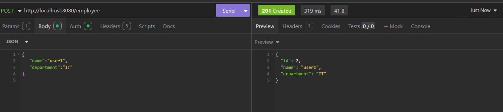
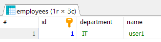
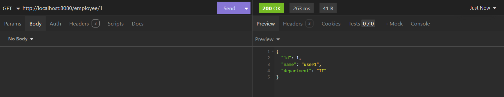
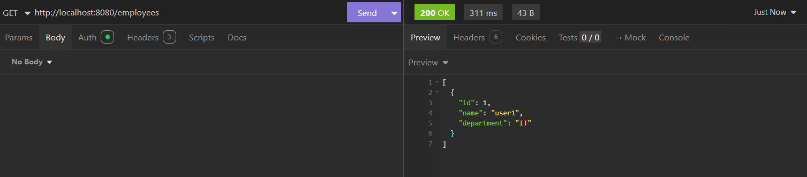

Aqui está a organização sugerida para o `README.md`:

```markdown
# Spring Boot 3 + JPA + MySQL CRUD

## Implementação  
Vamos utilizar o Spring Initializr para criar um projeto Spring Boot da seguinte forma:


## Dependências

No arquivo `pom.xml`, temos a dependência `spring-boot-starter-data-jpa`. Ela é utilizada em um projeto Spring Boot para incluir as dependências necessárias para trabalhar com a Java Persistence API (JPA) no acesso a dados e operações com banco de dados. Essa dependência inclui várias bibliotecas e componentes, como o Hibernate, que é uma implementação popular da especificação JPA. 

Ela fornece abstrações e funcionalidades que facilitam a interação com bancos de dados relacionais. Ao incluir essa dependência em um projeto Spring Boot, é possível aproveitar os recursos da JPA, como mapeamento de entidades, suporte a consultas no banco de dados e gerenciamento de transações, simplificando o desenvolvimento de aplicações baseadas em dados.

## Exemplo de `pom.xml`

```xml
<?xml version="1.0" encoding="UTF-8"?>
<project xmlns="http://maven.apache.org/POM/4.0.0" xmlns:xsi="http://www.w3.org/2001/XMLSchema-instance"
	xsi:schemaLocation="http://maven.apache.org/POM/4.0.0 https://maven.apache.org/xsd/maven-4.0.0.xsd">
	<modelVersion>4.0.0</modelVersion>
	<parent>
		<groupId>org.springframework.boot</groupId>
		<artifactId>spring-boot-starter-parent</artifactId>
		<version>3.2.10</version>
		<relativePath/> <!-- lookup parent from repository -->
	</parent>
	<groupId>com.example</groupId>
	<artifactId>boot-crud</artifactId>
	<version>0.0.1-SNAPSHOT</version>
	<name>boot-crud</name>
	<description>Demo project for Spring Boot</description>
	<url/>
	<licenses>
		<license/>
	</licenses>
	<developers>
		<developer/>
	</developers>
	<scm>
		<connection/>
		<developerConnection/>
		<tag/>
		<url/>
	</scm>
	<properties>
		<java.version>17</java.version>
	</properties>
	<dependencies>
		<dependency>
			<groupId>org.springframework.boot</groupId>
			<artifactId>spring-boot-starter-data-jpa</artifactId>
		</dependency>
		<dependency>
			<groupId>org.springframework.boot</groupId>
			<artifactId>spring-boot-starter-web</artifactId>
		</dependency>

		<dependency>
			<groupId>com.mysql</groupId>
			<artifactId>mysql-connector-j</artifactId>
			<scope>runtime</scope>
		</dependency>
		<dependency>
			<groupId>org.springframework.boot</groupId>
			<artifactId>spring-boot-starter-test</artifactId>
			<scope>test</scope>
		</dependency>
	</dependencies>

	<build>
		<plugins>
			<plugin>
				<groupId>org.springframework.boot</groupId>
				<artifactId>spring-boot-maven-plugin</artifactId>
			</plugin>
		</plugins>
	</build>

</project>
```

## Configuração do MySQL

No próximo passo, no arquivo `application.properties`, adicione a seguinte configuração para o MySQL:

- **spring.datasource.url**: Especifica a URL JDBC da conexão com o banco de dados MySQL. No nosso caso, ele se conectará a um banco de dados chamado “javainusedb” no localhost. O parâmetro `createDatabaseIfNotExist=true` garante que, se o banco de dados não existir, ele será criado. O parâmetro `useSSL=false` desativa a criptografia SSL para a conexão.

- **spring.datasource.username**: Especifica o nome de usuário a ser utilizado para autenticação ao conectar-se ao banco de dados MySQL. No nosso caso, o nome de usuário é “root”.

- **spring.datasource.password**: Especifica a senha a ser utilizada para autenticação ao conectar-se ao MySQL.

```properties
spring.application.name=boot-crud

spring.datasource.url=jdbc:mysql://localhost:3306/javainusedb?createDatabaseIfNotExist=true&useSSL=false
spring.datasource.username=root
spring.datasource.password=ER10ppuc@#

spring.jpa.properties.hibernate.dialect=org.hibernate.dialect.MySQLDialect
spring.jpa.hibernate.ddl-auto=update
```

Se iniciarmos a aplicação Spring Boot agora, ela será executada com sucesso, conectando-se ao banco de dados MySQL, e um banco de dados chamado *javainusedb* será criado automaticamente.

## Classe `Employee`

Em seguida, criamos uma classe de entidade chamada `Employee`. Essa classe será responsável por mapear os dados do empregado para a tabela MySQL chamada *employees*.

```java
package com.example.boot_crud.model;

import jakarta.persistence.*;

@Entity
@Table(name = "employees")
public class Employee {
    @Id
    @GeneratedValue(strategy = GenerationType.IDENTITY)
    private Long id;

    @Column(name="name")
    private String name;

    @Column(name = "department")
    private String department;


    public Employee(Long id, String name, String department) {
        this.department = department;
        this.name = name;
        this.id = id;
    }

    public Employee() {}

    public String getDepartment() {
        return department;
    }

    public void setDepartment(String department) {
        this.department = department;
    }

    public void setId(Long id) {
        this.id = id;
    }

    public String getName() {
        return name;
    }

    public void setName(String name) {
        this.name = name;
    }

    public Long getId() {
        return id;
    }
}
```

Nesta classe, utilizamos as seguintes anotações:

- **@Entity**: Essa anotação é usada para marcar a classe como uma entidade persistente, o que significa que pode ser armazenada e recuperada de um banco de dados.

- **@Table(name = “employees”)**: Essa anotação especifica o nome da tabela no banco de dados que corresponde a essa entidade. Neste caso, o nome da tabela é “employees”.

- **@Id**: Essa anotação é usada para marcar o campo da chave primária da entidade. Neste caso, o campo “id” é a chave primária.

- **@GeneratedValue(strategy = GenerationType.IDENTITY)**: Essa anotação especifica a estratégia de geração para o valor da chave primária. Neste caso, o valor da chave primária é gerado pelo banco de dados usando a estratégia “IDENTITY”. Essa estratégia indica que o valor da chave primária é gerado pelo banco de dados subjacente, geralmente usando uma coluna de auto incremento para gerar valores únicos de chave primária.

- **@Column(name = “name”)**: Essa anotação é usada para especificar o nome da coluna no banco de dados que corresponde ao campo “name”.

- **@Column(name = “department”)**: Essa anotação é usada para especificar o nome da coluna no banco de dados que corresponde ao campo “department”.

Além disso, anteriormente no arquivo `application.properties`, configuramos as seguintes propriedades do JPA:

- **spring.jpa.properties.hibernate.dialect=org.hibernate.dialect.MySQLDialect**: Essa propriedade especifica o dialeto do Hibernate a ser usado para a comunicação com o banco de dados MySQL. Neste caso, está definido como “org.hibernate.dialect.MySQLDialect”, indicando que o banco de dados MySQL será utilizado.

- **spring.jpa.hibernate.ddl-auto=update**: Essa propriedade determina como o Hibernate lida com o esquema do banco de dados durante a inicialização da aplicação. O valor “update” indica que o Hibernate deve tentar atualizar o esquema do banco de dados com base nas entidades definidas em sua aplicação. Ele comparará o esquema do banco de dados com as informações de mapeamento e aplicará quaisquer alterações necessárias para sincronizá-los. Por exemplo, se definirmos essa propriedade como “none”, o Hibernate não poderá fazer nenhuma alteração no esquema do banco de dados.

Se agora iniciarmos a aplicação Spring Boot e verificarmos o banco de dados MySQL, podemos ver que uma tabela chamada *employees* foi criada no banco de dados MySQL.

Aqui está uma versão organizada do seu README.md. Fiz ajustes na formatação e estrutura para facilitar a leitura e compreensão do conteúdo:

## Interface `EmployeeRepository`

Em seguida, criamos um repositório chamado `EmployeeRepository`. Esta é uma interface que estende a `JpaRepository`, a qual, por sua vez, estende a interface `CrudRepository`.

A interface `EmployeeRepository` é projetada especificamente para interagir com o banco de dados e realizar operações CRUD (Criar, Ler, Atualizar, Excluir) na entidade `Employee`. 

Os parâmetros genéricos `<Employee, Long>` indicam que o repositório lidará com objetos do tipo `Employee` e que seu identificador único será do tipo `Long`.

```java
package com.example.boot_crud.repository;

import org.springframework.data.jpa.repository.JpaRepository;
import com.example.boot_crud.model.Employee;

public interface EmployeeRepository extends JpaRepository<Employee, Long> {

}
```

Ao estendermos a interface `JpaRepository` na nossa interface `EmployeeRepository`, o Spring Data JPA cria automaticamente uma instância de `SimpleJpaRepository` e a atribui ao bean `EmployeeRepository` em tempo de execução. Isso significa que, quando usamos a interface `EmployeeRepository` em nosso código, os métodos definidos na interface `JpaRepository` (incluindo os que são herdados de `CrudRepository` e `PagingAndSortingRepository`) serão implementados pela classe `SimpleJpaRepository`.

## Create Employee API
### Classe `Employee`

Criamos uma classe de entidade chamada `Employee`. Essa classe será responsável por mapear os dados do empregado para a tabela MySQL chamada *employees*.

```java
package com.example.boot_crud.model;

import jakarta.persistence.*;

@Entity
@Table(name = "employees")
public class Employee {
    @Id
    @GeneratedValue(strategy = GenerationType.IDENTITY)
    private Long id;

    @Column(name="name")
    private String name;

    @Column(name = "department")
    private String department;


    public Employee(Long id, String name, String department) {
        this.department = department;
        this.name = name;
        this.id = id;
    }

    public Employee() {}

    public String getDepartment() {
        return department;
    }

    public void setDepartment(String department) {
        this.department = department;
    }

    public void setId(Long id) {
        this.id = id;
    }

    public String getName() {
        return name;
    }

    public void setName(String name) {
        this.name = name;
    }

    public Long getId() {
        return id;
    }
}
```

### Classe `EmployeeDto`

#### DTO (Data Transfer Object)

O uso de classes DTO permite uma clara separação entre a camada de apresentação e a camada de domínio. Os DTOs fornecem uma maneira de transferir dados entre diferentes camadas, como as camadas de controlador e serviço, sem vazar informações desnecessárias ou lógica específica do domínio.

Crie a classe `EmployeeDto` da seguinte forma:

```java
package com.example.boot_crud.dto;

public class EmployeeDto {

    private Long id;
    private String name;
    private String department;

    public EmployeeDto(Long id, String name, String department) {
        super();
        this.id = id;
        this.name = name;
        this.department = department;
    }

    public EmployeeDto() {

    }

    public Long getId() {
        return id;
    }

    public void setId(Long id) {
        this.id = id;
    }

    public String getName() {
        return name;
    }

    public void setName(String name) {
        this.name = name;
    }

    public String getDepartment() {
        return department;
    }

    public void setDepartment(String department) {
        this.department = department;
    }
}
```

### Classe `EmployeeMapper`

Na camada de serviço, precisamos converter a instância de `EmployeeDto` em uma instância de `Employee` e vice-versa. Realizamos essa operação de conversão usando o **Employee Mapper**.

```java
package com.example.boot_crud.mapper;

import com.example.boot_crud.dto.EmployeeDto;
import com.example.boot_crud.model.Employee;

public class EmployeeMapper {

    public static EmployeeDto mapToEmployeeDto(Employee employee) {
        return new EmployeeDto(employee.getId(), employee.getName(), employee.getDepartment());
    }

    public static Employee mapToEmployee(EmployeeDto employeeDto) {
        return new Employee(employeeDto.getId(), employeeDto.getName(), employeeDto.getDepartment());
    }

}
```
### Implementação do Serviço

Agora criaremos a camada de serviço. Primeiro, vamos criar uma interface chamada `EmployeeService` com um único método chamado `createEmployee`, que será responsável por criar um novo registro de funcionário. Estamos criando a interface de serviço primeiro, pois queremos seguir o princípio de programação para uma interface.

```java
package com.example.boot_crud.service;

import com.example.boot_crud.dto.EmployeeDto;

public interface EmployeeService {
    EmployeeDto createEmployee(EmployeeDto employeeDto);
}
```

Em seguida, implementamos a classe de serviço chamada `EmployeeServiceImpl`. Nesta classe, faremos a injeção do repositório. Há um método chamado `createEmployee`, que recebe um objeto do tipo `EmployeeDto` como parâmetro. Dentro desse método, ele mapeia o objeto `EmployeeDto` para um objeto `Employee` usando uma classe chamada `EmployeeMapper`. Em seguida, salvamos o objeto `Employee` no banco de dados usando o método `employeeRepository.save()`. Por fim, mapeamos o objeto `Employee` criado de volta para um objeto `EmployeeDto` usando o `EmployeeMapper` e o retornamos.

```java
package com.example.boot_crud.service;

import org.springframework.beans.factory.annotation.Autowired;
import org.springframework.stereotype.Service;

import com.example.boot_crud.mapper.EmployeeMapper;
import com.example.boot_crud.dto.EmployeeDto;
import com.example.boot_crud.model.Employee;
import com.example.boot_crud.repository.EmployeeRepository;

@Service
public class EmployeeServiceImpl implements EmployeeService {

    @Autowired
    private EmployeeRepository employeeRepository;

    @Override
    public EmployeeDto createEmployee(EmployeeDto employeeDto) {
        Employee employee = EmployeeMapper.mapToEmployee(employeeDto);
        Employee createdEmployee = employeeRepository.save(employee);
        return EmployeeMapper.mapToEmployeeDto(createdEmployee);
    }
}
```

### Implementação do Controlador

A classe `EmployeeController` é uma classe de controlador REST que lida com as requisições HTTP relacionadas às operações de funcionários. Ela utiliza a anotação `@RestController` do Spring para indicar que a classe é um controlador REST que facilita o mapeamento de requisições para métodos.

A classe possui uma dependência da classe `EmployeeService`, que é injetada usando a anotação `@Autowired`. Isso permite que a classe utilize os métodos fornecidos pelo `EmployeeService` para realizar operações relacionadas a funcionários.

A classe contém um único método, `createEmployee`, que está mapeado para uma requisição POST com o endpoint `/employee`. Este método recebe um objeto `EmployeeDto` como corpo da requisição, representando os dados do funcionário a serem criados. Ele invoca o método `createEmployee` do `EmployeeService` injetado, passando o `employeeDto` como argumento. A resposta da chamada do método do serviço é então encapsulada em um objeto `ResponseEntity`, especificando o DTO do funcionário criado e o código de status HTTP `HttpStatus.CREATED` como resposta.

```java
package com.example.boot_crud.controller;

import org.springframework.beans.factory.annotation.Autowired;
import org.springframework.http.HttpStatus;
import org.springframework.http.ResponseEntity;
import org.springframework.web.bind.annotation.PostMapping;
import org.springframework.web.bind.annotation.RequestBody;
import org.springframework.web.bind.annotation.RestController;

import com.example.boot_crud.dto.EmployeeDto;
import com.example.boot_crud.service.EmployeeService;

@RestController
public class EmployeeController {

    @Autowired
    private EmployeeService employeeService;

    @PostMapping(value = "/employee")
    public ResponseEntity<EmployeeDto> createEmployee(@RequestBody EmployeeDto employeeDto) {
        EmployeeDto createdEmployee = employeeService.createEmployee(employeeDto);
        return new ResponseEntity<>(createdEmployee, HttpStatus.CREATED);
    }
}
```


Se verificarmos o banco de dados MySQL


## Get Employee By Id API
### Implementação do Serviço

Crie uma exceção chamada `EmployeeNotFoundException`, que será lançada se o funcionário com o ID especificado não for encontrado.

```java
package com.example.boot_crud.exception;

public class EmployeeNotFoundException extends Exception {

    private static final long serialVersionUID = 1L;

    public EmployeeNotFoundException() {
    }

    public EmployeeNotFoundException(String message) {
        super(message);
    }
}
```
Na interface `EmployeeService`, o seguinte método foi adicionado: `EmployeeDto getEmployeeById(Long employeeId) throws EmployeeNotFoundException`. 

Este método é utilizado para recuperar informações sobre um funcionário com base em seu identificador único, que é fornecido como o parâmetro `employeeId`. O método retorna um objeto `EmployeeDto`, que é um DTO (Data Transfer Object) contendo os detalhes do funcionário. Além disso, este método lança uma `EmployeeNotFoundException` se nenhum funcionário com o ID fornecido for encontrado. Essa exceção é utilizada para tratar casos em que o funcionário solicitado não existe no sistema ou não pode ser encontrado. Ao lançar essa exceção, o código chamador pode tratar e responder a esses erros de maneira apropriada.


Em seguida, na classe `EmployeeServiceImpl`, implementamos o método `getEmployeeById` da interface `EmployeeService`. Este método recebe um `employeeId` como parâmetro e retorna um objeto `EmployeeDto`, que representa um Data Transfer Object (DTO) contendo ```java
package com.example.boot_crud.service;

import com.example.boot_crud.dto.EmployeeDto;
import com.example.boot_crud.exception.EmployeeNotFoundException;

public interface EmployeeService {
    EmployeeDto createEmployee(EmployeeDto employeeDto);
    EmployeeDto getEmployeeById(Long employeeId) throws EmployeeNotFoundException;
}
```informações sobre o funcionário.

O método começa usando o `employeeRepository`, que é uma instância de um repositório Spring Data JPA, para recuperar um registro de funcionário do banco de dados utilizando o `employeeId`. O método `findById` retorna uma instância de `Optional<Employee>`, que pode conter o objeto `Employee` se ele existir.

Em seguida, o código verifica se o objeto `Employee` está vazio ou não, utilizando o método `isEmpty()`. Se estiver vazio, significa que nenhum registro de funcionário foi encontrado com o `employeeId` fornecido. Nesse caso, o código lança uma `EmployeeNotFoundException`, que é uma classe de exceção personalizada. A mensagem da exceção inclui o `employeeId` que não foi encontrado.

Se o objeto `Employee` não estiver vazio, significa que existe um registro de funcionário válido com o `employeeId` fornecido. Para converter o objeto `Employee` em um objeto `EmployeeDto`, o código utiliza a classe `EmployeeMapper`, que fornece um método estático chamado `mapToEmployeeDto`. O método `mapToEmployeeDto` recebe um objeto `Employee` como entrada e retorna um objeto `EmployeeDto`.

Por fim, o método retorna o objeto `EmployeeDto` representando o funcionário encontrado no banco de dados.

```java
package com.example.boot_crud.service;

import com.example.boot_crud.exception.EmployeeNotFoundException;
import org.springframework.beans.factory.annotation.Autowired;
import org.springframework.stereotype.Service;

import com.example.boot_crud.mapper.EmployeeMapper;
import com.example.boot_crud.dto.EmployeeDto;
import com.example.boot_crud.model.Employee;
import com.example.boot_crud.repository.EmployeeRepository;

import java.util.Optional;

@Service
public class EmployeeServiceImpl implements EmployeeService {

    @Autowired
    private EmployeeRepository employeeRepository;

    @Override
    public EmployeeDto createEmployee(EmployeeDto employeeDto) {
        Employee employee = EmployeeMapper.mapToEmployee(employeeDto);
        Employee createdEmployee = employeeRepository.save(employee);
        return EmployeeMapper.mapToEmployeeDto(createdEmployee);
    }

    @Override
    public EmployeeDto getEmployeeById(Long employeeId) throws EmployeeNotFoundException {
        Optional<Employee> employee = employeeRepository.findById(employeeId);
        if (employee.isEmpty()) {
            throw new EmployeeNotFoundException("Employee with id - " + employeeId + " not found.");
        }
        return EmployeeMapper.mapToEmployeeDto(employee.get());
    }
}
```
### Implementação do Controlador

Em seguida, na classe do controlador, definimos um método de requisição GET que recupera os detalhes de um funcionário pelo seu ID. A anotação `@GetMapping` especifica que este método deve tratar requisições HTTP GET com a URL especificada “/employee/{employeeId}”. O `employeeId` é uma variável de caminho e é extraído da URL usando a anotação `@PathVariable`. 

O método lança uma `EmployeeNotFoundException` se o funcionário com o ID fornecido não for encontrado. Dentro do método, ele delega a responsabilidade de recuperar os detalhes do funcionário para o `employeeService`, que é uma instância da classe `EmployeeService`. O método chama o método `getEmployeeById` do `employeeService`, passando o `employeeId` como parâmetro. O resultado, que é uma instância de `EmployeeDto`, é então retornado como resposta com um código de status OK (200) usando a classe `ResponseEntity`. Se o funcionário solicitado não for encontrado, ele captura a `EmployeeNotFoundException` e a relança, permitindo que a exceção seja tratada por qualquer manipulador de exceção definido na aplicação.

```java
package com.example.boot_crud.controller;

import com.example.boot_crud.exception.EmployeeNotFoundException;
import org.springframework.beans.factory.annotation.Autowired;
import org.springframework.http.HttpStatus;
import org.springframework.http.ResponseEntity;
import org.springframework.web.bind.annotation.*;

import com.example.boot_crud.dto.EmployeeDto;
import com.example.boot_crud.service.EmployeeService;

import java.util.List;

@RestController
public class EmployeeController {

    private List<EmployeeDto> employees;

    @Autowired
    private EmployeeService employeeService;

    @PostMapping(value = "/employee")
    public ResponseEntity<EmployeeDto> createEmployee(@RequestBody EmployeeDto employeeDto) {
        EmployeeDto createdEmployee = employeeService.createEmployee(employeeDto);
        return new ResponseEntity<>(createdEmployee, HttpStatus.CREATED);
    }

    @GetMapping(value = "/employee/{employeeId}")
    public ResponseEntity<EmployeeDto> getEmployeeById(@PathVariable("employeeId") Long employeeId)
            throws EmployeeNotFoundException {
        try {
            EmployeeDto employee = employeeService.getEmployeeById(employeeId);
            return new ResponseEntity<>(employee, HttpStatus.OK);
        } catch (EmployeeNotFoundException employeeNotFoundException) {
            throw employeeNotFoundException;
        }
    }
}
```

## Get All Employees
### Implementação do Serviço

Em seguida, definimos o método da interface `EmployeeService` chamado `getEmployees()`. Este método retorna uma lista de objetos `EmployeeDto`.

```java
package com.example.boot_crud.service;

import com.example.boot_crud.dto.EmployeeDto;
import com.example.boot_crud.exception.EmployeeNotFoundException;

import java.util.List;

public interface EmployeeService {
    EmployeeDto createEmployee(EmployeeDto employeeDto);
    EmployeeDto getEmployeeById(Long employeeId) throws EmployeeNotFoundException;
    List<EmployeeDto> getEmployees();
}
```
Na classe `EmployeeServiceImpl`, definimos o método `getEmployees`, que sobrescreve um método com a mesma assinatura na interface `EmployeeService`. Ele retorna uma lista de objetos `EmployeeDto`.

Dentro do método, ele usa o `employeeRepository` para recuperar uma lista de objetos `Employee` do banco de dados MySQL. Em seguida, utiliza o método `stream` na lista de objetos `Employee` para criar um fluxo e aplica uma operação de mapeamento a cada elemento do fluxo. A operação de mapeamento recebe uma expressão lambda que mapeia cada objeto `Employee` para um objeto `EmployeeDto` usando o método `EmployeeMapper.mapToEmployeeDto`.

Por fim, utiliza a operação `collect` para coletar os objetos `EmployeeDto` mapeados em uma lista e retorna essa lista.

```java
package com.example.boot_crud.service;

import java.util.List;
import java.util.Optional;
import java.util.stream.Collectors;

import org.springframework.beans.factory.annotation.Autowired;
import org.springframework.stereotype.Service;

import com.example.boot_crud.dto.EmployeeDto;
import com.example.boot_crud.model.Employee;
import com.example.boot_crud.exception.EmployeeNotFoundException;
import com.example.boot_crud.mapper.EmployeeMapper;
import com.example.boot_crud.repository.EmployeeRepository;

@Service
public class EmployeeServiceImpl implements EmployeeService {

    @Autowired
    private EmployeeRepository employeeRepository;

    @Override
    public EmployeeDto createEmployee(EmployeeDto employeeDto) {
        Employee employee = EmployeeMapper.mapToEmployee(employeeDto);
        Employee createdEmployee = employeeRepository.save(employee);
        return EmployeeMapper.mapToEmployeeDto(createdEmployee);
    }

    @Override
    public EmployeeDto getEmployeeById(Long employeeId) throws EmployeeNotFoundException {
        Optional<Employee> employee = employeeRepository.findById(employeeId);
        if (employee.isEmpty()) {
            throw new EmployeeNotFoundException("Employee with id - " + employeeId + " not found.");
        }
        return EmployeeMapper.mapToEmployeeDto(employee.get());
    }

    @Override
    public List<EmployeeDto> getEmployees() {
        List<Employee> employees = employeeRepository.findAll();
        return employees.stream().map((emp) -> EmployeeMapper.mapToEmployeeDto(emp)).collect(Collectors.toList());
    }
}
```
### Implementação do Controlador

Por fim, na classe `EmployeeController`, definimos o método `getEmployees`. A anotação `@GetMapping(value = "/employees")` é uma anotação de mapeamento que associa o método ao endpoint de URL específico “/employees” e especifica que ele lidará com requisições GET. 

A implementação do método recupera uma lista de funcionários usando o método `employeeService.getEmployees()`, que é responsável por buscar os dados dos funcionários de uma fonte de dados, como um banco de dados. A lista de funcionários recuperada é então encapsulada em um `ResponseEntity`, que é um objeto de resposta HTTP que nos permite controlar o status e os cabeçalhos da resposta HTTP. Neste caso, o `ResponseEntity` está sendo criado com a lista de funcionários como o corpo da resposta e `HttpStatus.OK` como o código de status. Por fim, o objeto `ResponseEntity` é retornado do método, indicando que a resposta do endpoint conterá uma lista de funcionários.

```java
package com.example.boot_crud.controller;

import com.example.boot_crud.exception.EmployeeNotFoundException;
import org.springframework.beans.factory.annotation.Autowired;
import org.springframework.http.HttpStatus;
import org.springframework.http.ResponseEntity;
import org.springframework.web.bind.annotation.*;

import com.example.boot_crud.dto.EmployeeDto;
import com.example.boot_crud.service.EmployeeService;

import java.util.List;

@CrossOrigin(origins = "http://localhost:3000")
@RestController
public class EmployeeController {

    private List<EmployeeDto> employees;

    @Autowired
    private EmployeeService employeeService;

    @PostMapping(value = "/employee")
    public ResponseEntity<EmployeeDto> createEmployee(@RequestBody EmployeeDto employeeDto) {
        EmployeeDto createdEmployee = employeeService.createEmployee(employeeDto);
        return new ResponseEntity<>(createdEmployee, HttpStatus.CREATED);
    }

    @GetMapping(value = "/employee/{employeeId}")
    public ResponseEntity<EmployeeDto> getEmployee(@PathVariable("employeeId") Long employeeId)
            throws EmployeeNotFoundException {
        try {
            EmployeeDto employee = employeeService.getEmployeeById(employeeId);
            return new ResponseEntity<>(employee, HttpStatus.CREATED);
        } catch (EmployeeNotFoundException ex) {
            throw ex;
        }
    }

    @GetMapping(value = "/employees")
    public ResponseEntity<List<EmployeeDto>> getEmployees() {
        List<EmployeeDto> employees = employeeService.getEmployees();
        return new ResponseEntity<>(employees, HttpStatus.OK);
    }
}
```


## Delete Employee By Id API
### Implementação do Serviço

O método `deleteEmployee` na interface `EmployeeService` é utilizado para excluir um registro de funcionário de um banco de dados ou de qualquer outro mecanismo de persistência. Ele recebe o `employeeId` como parâmetro, que especifica o identificador único do funcionário. Se o funcionário com o `employeeId` especificado não existir, o método lança uma `EmployeeNotFoundException`.

```java
package com.example.boot_crud.service;

import com.example.boot_crud.dto.EmployeeDto;
import com.example.boot_crud.exception.EmployeeNotFoundException;

import java.util.List;

public interface EmployeeService {
    EmployeeDto createEmployee(EmployeeDto employeeDto);
    EmployeeDto getEmployeeById(Long employeeId) throws EmployeeNotFoundException;
    List<EmployeeDto> getEmployees();
    void deleteEmployee(Long employeeId) throws EmployeeNotFoundException;
}
```
O método `deleteEmployee` exclui um funcionário do repositório de funcionários com base em seu ID. O método recebe um parâmetro do tipo `Long` chamado `employeeId`, que representa o ID do funcionário a ser excluído.

Ele utiliza o `employeeRepository` para encontrar o funcionário com o ID fornecido, chamando o método `findById`. Esse método retorna um `Optional<Employee>`, que pode ou não conter um valor.

Em seguida, verifica se o `Optional<Employee>` está vazio usando o método `isEmpty`. Se estiver vazio, isso significa que o funcionário com o ID fornecido não existe no repositório. Nesse caso, o método lança uma `EmployeeNotFoundException` com uma mensagem específica mencionando o ID do funcionário.

Se o funcionário existir, o método prossegue para excluir o funcionário do repositório, chamando o método `deleteById` no `employeeRepository` com o parâmetro `employeeId`.

```java
package com.example.boot_crud.service;

import java.util.List;
import java.util.Optional;
import java.util.stream.Collectors;

import org.springframework.beans.factory.annotation.Autowired;
import org.springframework.stereotype.Service;

import com.example.boot_crud.dto.EmployeeDto;
import com.example.boot_crud.model.Employee;
import com.example.boot_crud.exception.EmployeeNotFoundException;
import com.example.boot_crud.mapper.EmployeeMapper;
import com.example.boot_crud.repository.EmployeeRepository;

@Service
public class EmployeeServiceImpl implements EmployeeService {

    @Autowired
    private EmployeeRepository employeeRepository;

    @Override
    public EmployeeDto createEmployee(EmployeeDto employeeDto) {
        Employee employee = EmployeeMapper.mapToEmployee(employeeDto);
        Employee createdEmployee = employeeRepository.save(employee);
        return EmployeeMapper.mapToEmployeeDto(createdEmployee);
    }

    @Override
    public EmployeeDto getEmployeeById(Long employeeId) throws EmployeeNotFoundException {
        Optional<Employee> employee = employeeRepository.findById(employeeId);
        if (employee.isEmpty()) {
            throw new EmployeeNotFoundException("Employee with id - " + employeeId + " not found.");
        }
        return EmployeeMapper.mapToEmployeeDto(employee.get());
    }

    @Override
    public List<EmployeeDto> getEmployees() {
        List<Employee> employees = employeeRepository.findAll();
        return employees.stream().map((emp) -> EmployeeMapper.mapToEmployeeDto(emp)).collect(Collectors.toList());
    }

    @Override
    public void deleteEmployee(Long employeeId) throws EmployeeNotFoundException {
        Optional<Employee> employee = employeeRepository.findById(employeeId);
        if (employee.isEmpty()) {
            throw new EmployeeNotFoundException("Employee with id - " + employeeId + " not found.");
        }
        employeeRepository.deleteById(employeeId);
    }
}
```

### Implementação do Controlador

O método `deleteEmployees` é um método de mapeamento de requisição DELETE que exclui um funcionário com o `employeeId` especificado. Ele lança uma `EmployeeNotFoundException` se o funcionário com o ID especificado não for encontrado. Após excluir o funcionário, ele retorna um `ResponseEntity` com o status `HttpStatus.NO_CONTENT`.

```java
package com.example.boot_crud.controller;

import com.example.boot_crud.exception.EmployeeNotFoundException;
import org.springframework.beans.factory.annotation.Autowired;
import org.springframework.http.HttpStatus;
import org.springframework.http.ResponseEntity;
import org.springframework.web.bind.annotation.*;

import com.example.boot_crud.dto.EmployeeDto;
import com.example.boot_crud.service.EmployeeService;

import java.util.List;

@CrossOrigin(origins = "http://localhost:3000")
@RestController
public class EmployeeController {

    private List<EmployeeDto> employees;

    @Autowired
    private EmployeeService employeeService;

    @PostMapping(value = "/employee")
    public ResponseEntity<EmployeeDto> createEmployee(@RequestBody EmployeeDto employeeDto) {
        EmployeeDto createdEmployee = employeeService.createEmployee(employeeDto);
        return new ResponseEntity<>(createdEmployee, HttpStatus.CREATED);
    }

    @GetMapping(value = "/employee/{employeeId}")
    public ResponseEntity<EmployeeDto> getEmployee(@PathVariable("employeeId") Long employeeId)
            throws EmployeeNotFoundException {
        try {
            EmployeeDto employee = employeeService.getEmployeeById(employeeId);
            return new ResponseEntity<>(employee, HttpStatus.CREATED);
        } catch (EmployeeNotFoundException ex) {
            throw ex;
        }
    }

    @GetMapping(value = "/employees")
    public ResponseEntity<List<EmployeeDto>> getEmployees() {
        List<EmployeeDto> employees = employeeService.getEmployees();
        return new ResponseEntity<>(employees, HttpStatus.CREATED);
    }

    @DeleteMapping(value = "/employee/{employeeId}")
    public ResponseEntity<HttpStatus> deleteEmployees(@PathVariable("employeeId") Long employeeId)
            throws EmployeeNotFoundException {
        employeeService.deleteEmployee(employeeId);
        return new ResponseEntity<>(HttpStatus.NO_CONTENT);
    }
}
```
