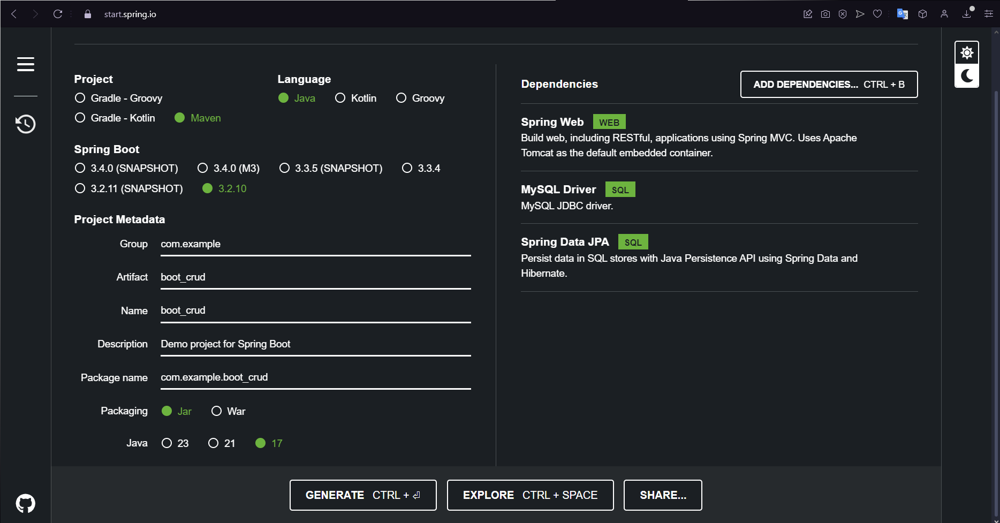

# Spring Boot 3 + JPA + MySQL CRUD

## Implementação  
Vamos utilizar o Spring Initializr para criar um projeto Spring Boot da seguinte forma:



## Dependências

No arquivo `pom.xml`, temos a dependência `spring-boot-starter-data-jpa`. Ela é utilizada em um projeto Spring Boot para incluir as dependências necessárias para trabalhar com a Java Persistence API (JPA) no acesso a dados e operações com banco de dados. Essa dependência inclui várias bibliotecas e componentes, como o Hibernate, que é uma implementação popular da especificação JPA. 

Ela fornece abstrações e funcionalidades que facilitam a interação com bancos de dados relacionais. Ao incluir essa dependência em um projeto Spring Boot, é possível aproveitar os recursos da JPA, como mapeamento de entidades, suporte a consultas no banco de dados e gerenciamento de transações, simplificando o desenvolvimento de aplicações baseadas em dados.

## Exemplo de `pom.xml`

```xml
<?xml version="1.0" encoding="UTF-8"?>
<project xmlns="http://maven.apache.org/POM/4.0.0" xmlns:xsi="http://www.w3.org/2001/XMLSchema-instance"
	xsi:schemaLocation="http://maven.apache.org/POM/4.0.0 https://maven.apache.org/xsd/maven-4.0.0.xsd">
	<modelVersion>4.0.0</modelVersion>

	<parent>
		<groupId>org.springframework.boot</groupId>
		<artifactId>spring-boot-starter-parent</artifactId>
		<version>3.2.10</version>
		<relativePath/> <!-- lookup parent from repository -->
	</parent>

	<groupId>com.example</groupId>
	<artifactId>boot-crud</artifactId>
	<version>0.0.1-SNAPSHOT</version>
	<name>boot-crud</name>
	<description>Demo project for Spring Boot</description>

	<properties>
		<java.version>17</java.version>
	</properties>

	<dependencies>
		<dependency>
			<groupId>org.springframework.boot</groupId>
			<artifactId>spring-boot-starter-data-jpa</artifactId>
		</dependency>
		<dependency>
			<groupId>org.springframework.boot</groupId>
			<artifactId>spring-boot-starter-web</artifactId>
		</dependency>
		<dependency>
			<groupId>com.mysql</groupId>
			<artifactId>mysql-connector-j</artifactId>
			<scope>runtime</scope>
		</dependency>
		<dependency>
			<groupId>org.springframework.boot</groupId>
			<artifactId>spring-boot-starter-test</artifactId>
			<scope>test</scope>
		</dependency>
	</dependencies>

	<build>
		<plugins>
			<plugin>
				<groupId>org.springframework.boot</groupId>
				<artifactId>spring-boot-maven-plugin</artifactId>
			</plugin>
		</plugins>
	</build>

</project>
```
